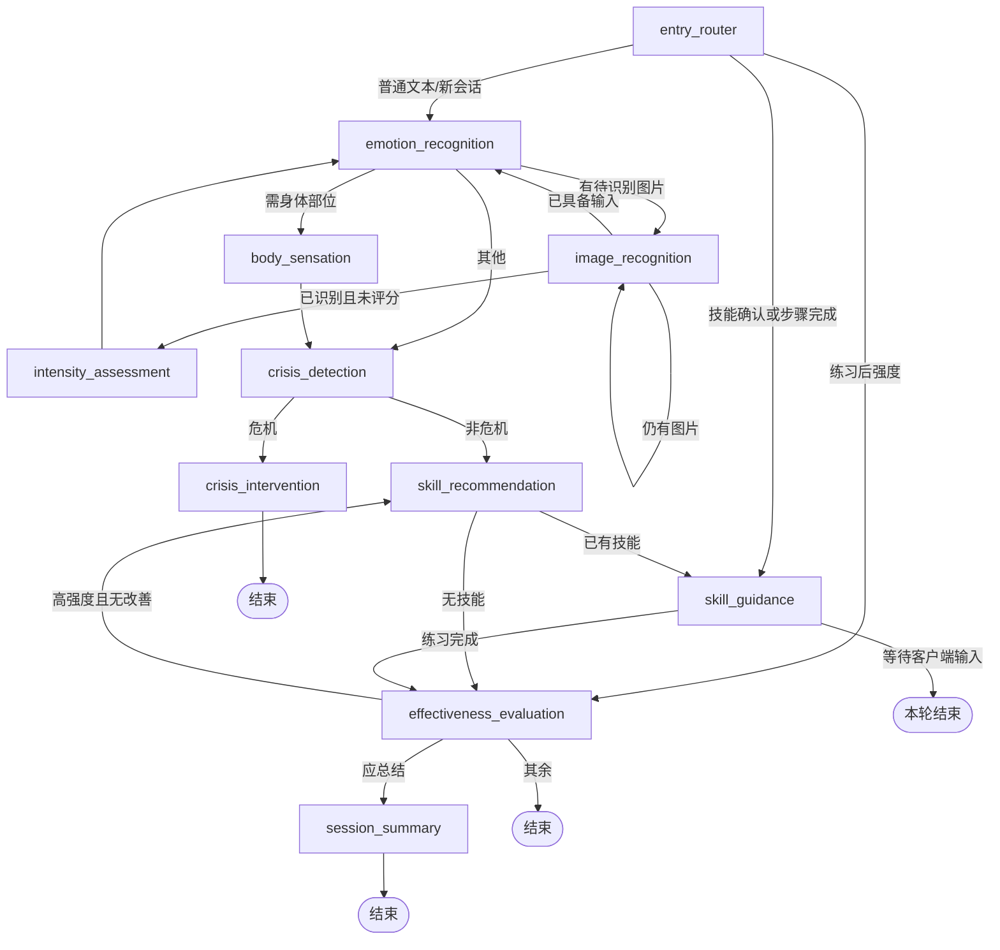
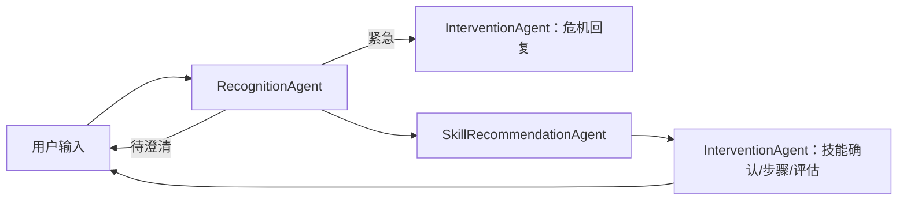

# Agent 架构文档（Agent Architecture）

> 基于 `backend/app/agent/`、`app/core/` 与对话路由源码梳理，更新时间：2026-07-14。

## 1. 架构结论

当前系统有两种 Agent 编排实现：

- **默认且建议使用：LangGraph 状态图**——由 `POST /api/chat/message` 驱动，图定义在 `app/agent/langgraph_builder.py`。
- **兼容实现：顺序式多 Agent 协调器**——由 `POST /api/chat/message/multi-agent` 驱动，按“识别 → 推荐 → 干预”执行。

二者均服务于同一目标，但不是同一条流水线，状态持久化方式、危机判定工具和引导细节存在差异。客户端若无迁移需求，应固定调用默认端点。

## 2. 默认 LangGraph 架构

### 2.1 状态模型

`AgentState` 是所有节点共享的 `TypedDict`，核心字段可归为：

| 分组 | 代表字段 | 用途 |
| --- | --- | --- |
| 会话和历史 | `session_id`、`user_id`、`messages` | 绑定用户会话，`messages` 通过 `operator.add` 追加。 |
| 情绪输入 | `current_emotion`、`intensity`、`body_sensation`、`image_emotion`、`pending_image_urls` | 合并文本、图片、强度和身体感知。 |
| 危机 | `is_crisis`、`risk_level`、`crisis_trigger` | 决定是否短路到危机干预。 |
| 技能练习 | `recommended_skill`、`skill_step`、`skill_confirmation`、`guidance_state` | 保存推荐、确认和逐步练习的进度。 |
| 评估和收尾 | `before_intensity`、`after_intensity`、`effectiveness`、`session_summary` | 评估练习效果并生成总结。 |
| 人机交互控制 | `request_type`、`next_action`、`requires_user_input`、`step_completed` | 让 API 把下一步渲染为正确的输入组件。 |

状态初始化由 `create_initial_state(session_id, user_id)` 完成。默认对话端点使用 `MemorySaver`，以 `session.id` 作为 LangGraph `thread_id`；它仅在当前进程内有效。

### 2.2 图与路由

入口路由并不通过自然语言意图直接选择节点，而是通过上一轮 `next_action` 与当前 `request_type` 恢复流程：技能确认/步骤完成进入引导，练习后强度进入评估，其他进入情绪识别。这是对话 UI 与状态机的契约核心。

## 3. 节点职责与关键决策

| 节点 | 输入/依赖 | 输出与决策 |
| --- | --- | --- |
| `emotion_recognition` | 图片情绪、强度、身体选择、近 5 条历史、`LLMClient` | 优先级为图片 → 强度 → 身体辅助 → LLM 文本；写入 `current_emotion`，不足信息时请求澄清。 |
| `image_recognition` | `pending_image_urls`、`VisionClient` | 逐张识别图片情绪；若需要强度则转评分。 |
| `intensity_assessment` | `intensity` | 缺少评分时写 `wait_intensity_rating`，随后回情绪识别。 |
| `body_sensation` | `body_sensation` | 在缺失时请求 body selector；完成后继续危机检测。 |
| `crisis_detection` | `CrisisDetector`、LLM 二次确认 | 先判强度、关键词、近期重复高强度；规则触发或强度 ≥7 时再做语义确认。 |
| `crisis_intervention` | 当前情绪、风险等级、LLM | 生成短危机话术、求助建议，设 `should_end=True`。 |
| `skill_recommendation` | `SkillRecommender`、DBT 技能库、历史练习记录 | 按情绪与强度推荐技能，过滤最近无效技能，写入练习前强度和确认等待状态。 |
| `skill_guidance` | DBT 步骤、确认/完成状态、LLM | 请求确认，逐步输出指引，最后标记 `skill_completed`。 |
| `effectiveness_evaluation` | 前后强度、`Evaluator` | 请求练习后评分，计算有效/一般/无效；高强度且未改善会清除技能以便重新推荐，否则进入总结。 |
| `session_summary` | 全部消息、LLM | 生成摘要和结束语，设会话完成。 |

## 4. 一次标准交互

1. 客户端提交 `message`，可附 `message_type` 与结构化 `metadata`；API 将 `image_selection`、`intensity_rating`、`body_selection`、`skill_confirmation`、`step_completion` 写入状态。
2. 图先识别情绪，并把 `current_emotion = {type, intensity, confidence, reason}` 写入状态。
3. 危机检测若确认风险，直接产生危机回复并结束本轮；否则按规则选择 DBT 技能。
4. API 根据 `requires_user_input + next_action` 返回一个 `requires_input` 描述，前端据此展示强度滑条、技能确认、步骤完成或身体部位选择器。
5. 客户端把组件结果作为下一轮结构化消息提交。入口路由恢复到技能引导或效果评估，不会重新从普通情绪识别开始。
6. 练习结束后用户提交强度，评估节点计算效果并生成反馈/总结；API 保存每轮用户与助手文本，并更新会话的初始情绪与危机标记。

`requires_input` 是前后端的控制面协议，不是展示性字段。前端不应只把用户选择转成自然语言；应保留相应 `message_type`，并按下表提供 metadata。

| `message_type` | 推荐 metadata |
| --- | --- |
| `image_selection` | `{ "emotion_type": "anxiety", "image_urls": ["..."] }` |
| `intensity_rating` | `{ "value": 0..10 }` 或 `{ "intensity": 0..10 }` |
| `body_selection` | `{ "selected_parts": ["chest", "abdomen"] }` |
| `skill_confirmation` | `{ "choice": "愿意" }` |
| `step_completion` | 可为空；服务端以消息类型标记完成。 |

## 5. 规则、模型与降级

### 情绪和技能

LLM 客户端使用 OpenAI 兼容接口，模型、温度、超时和 token 上限由 `LLM_*` 配置控制。未配置 LLM 时，情绪识别 Agent 有关键词回退，技能推荐器有“情绪类型 × 强度”的规则表，并会返回模板化话术。技能内容是进程内 `SKILLS_DATABASE`，不是数据库表。

### 危机安全

危机检测采取“规则优先 + LLM 语义确认”：

- 规则：自杀/自残/绝望/无价值等关键词，强度阈值（默认 9），以及 7 日内重复高强度次数（默认 3）。
- 二次确认：规则已命中或强度不低于 7 时请求 LLM 判断 `is_crisis` 与风险等级。
- 编排：确认危机后跳过技能推荐，进入危机干预并终止图。

由于这是心理危机场景，LLM 的确认不能取代人工安全流程；应把 `CrisisDetector.create_crisis_record()` 接入图，并对关键结果设审计、告警和人工处置闭环。

## 6. 兼容的顺序式多 Agent 路径

`/chat/message/multi-agent` 使用 `AgentCoordinator`：

- `RecognitionAgent` 用独立提示词和独立 `recognition_agent.tools.CrisisDetector` 识别情绪、意图与紧急情况。
- `SkillRecommendationAgent` 用 LLM JSON 输出推荐；失败时退回规则。
- `InterventionAgent` 自身维护 `SkillGuidance` 实例状态，并处理技能确认、步骤、评估和结束。
- 该路径把可 JSON 化的状态写进 `chat_sessions.agent_state`；其消息总线是内存单例，但当前协调器主路径是直接方法调用，消息总线未构成关键编排通道。

与默认图相比，此路径的状态契约不完全相同，且其 `SkillGuidance` 作为全局 coordinator 子对象，在并发会话时有交叉状态风险。因此它应被视作兼容/实验接口，而不是与默认接口并行演进的第二主线。

## 7. 建议的收敛方案

1. 以 LangGraph 作为唯一编排引擎，把必要的识别/推荐提示词与规则迁入节点；为 multi-agent 端点发布弃用时间表。
2. 选择持久化 checkpointer（数据库或 Redis）并将会话所有权绑定为 `(session_id, user_id)`，以支持重启、多实例和防止跨用户访问。
3. 在节点返回中统一“状态变更 + 领域事件”，例如 `CrisisDetected`、`SkillPracticed`；由事务性处理器落库到 `crisis_events` 和 `skill_usage_records`。
4. 为每个 `next_action` 编写端到端契约测试，覆盖“推荐拒绝、最后一步完成、无改善重推、危机短路、图片评分”等分支。

## 8. 关联源码

- 状态定义：[state.py](/Users/zeno/program/EmotionalAssistant/backend/app/agent/state.py)
- 图构建：[langgraph_builder.py](/Users/zeno/program/EmotionalAssistant/backend/app/agent/langgraph_builder.py)
- 节点目录：[nodes](/Users/zeno/program/EmotionalAssistant/backend/app/agent/nodes)
- 对话适配：[chat.py](/Users/zeno/program/EmotionalAssistant/backend/app/api/chat.py)
- 兼容协调器：[coordinator.py](/Users/zeno/program/EmotionalAssistant/backend/app/agent/coordinator.py)
