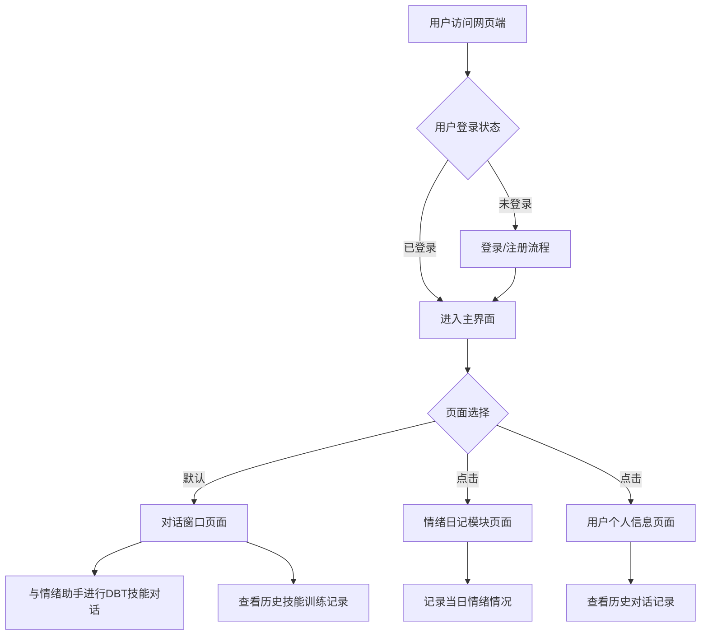
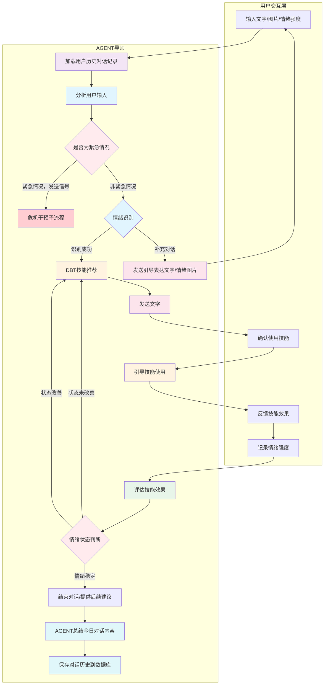
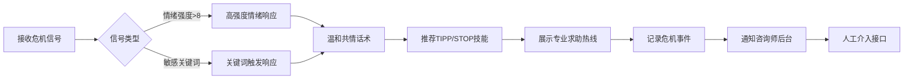
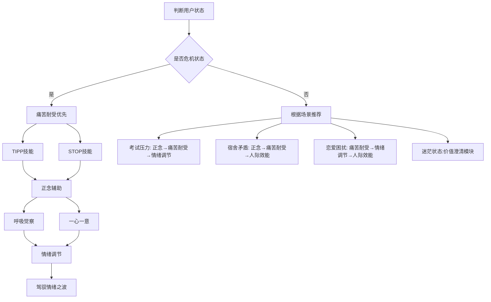
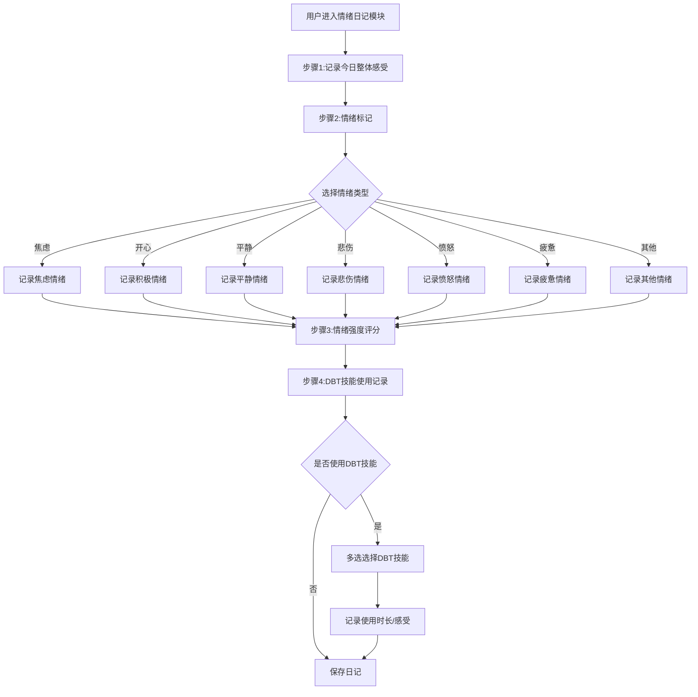
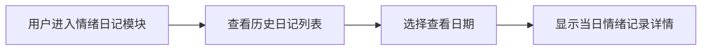
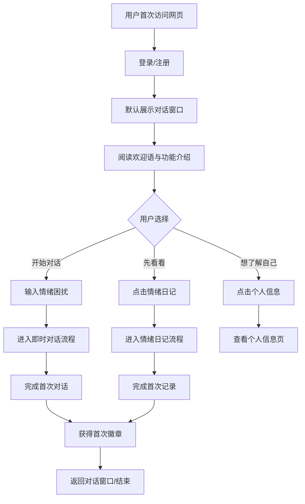
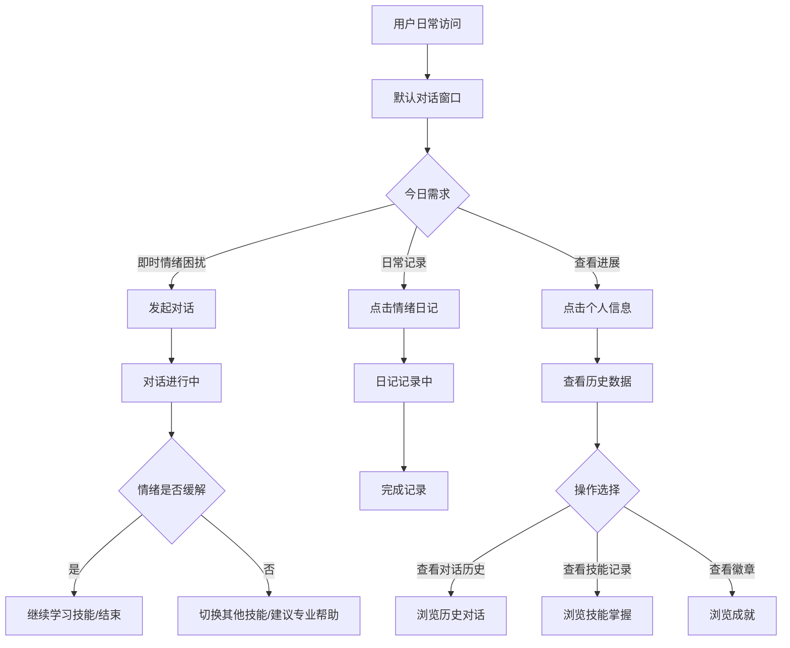

# 业务流程图

# **整体业务流程图**

## **一、系统整体架构流程**

### **1\.1 用户访问入口与模块选择**

---

## **二、即时对话功能模块流程**

### **2\.1 核心对话流程**

### **2\.2 危机干预子流程**

### **2\.3 DBT技能推荐流程**

---

## **三、情绪日记功能模块流程**

### **3\.1 情绪日记记录流程**

### **3\.2 情绪日记查看与回顾流程**

---

## **四、用户完整使用路径汇总**

### **4\.1 新用户首次使用路径**

### **4\.2 老用户日常使用路径**

