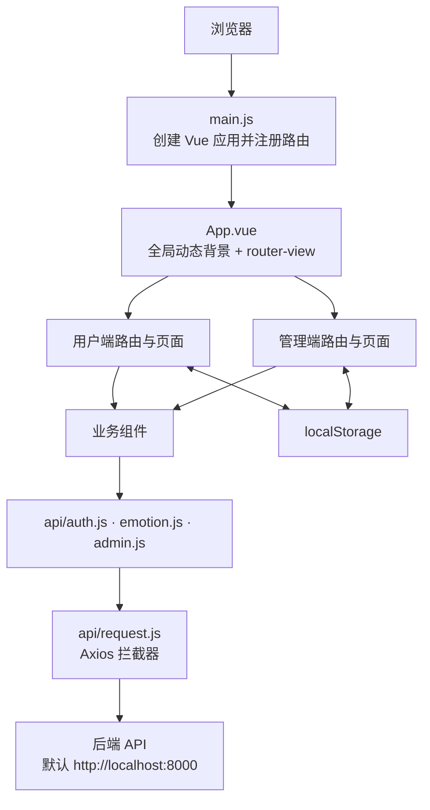
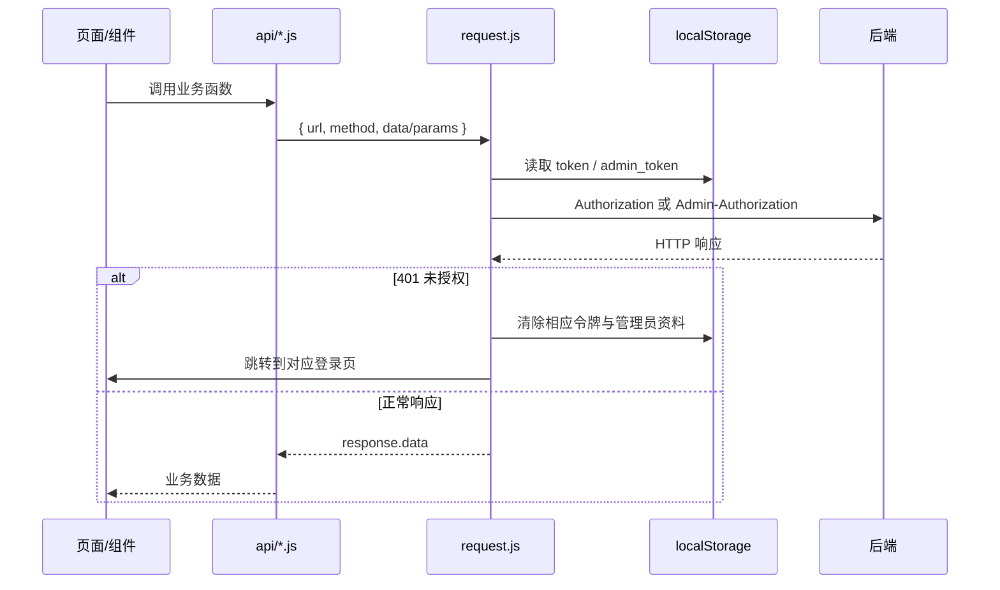

# 前端架构说明（当前实现）

> 本文以 `frontend/` 当前代码为准，记录已落地的结构、运行时数据流和已知边界；它不是早期规划文档。最后更新：2026-07-14。

## 1. 概览

前端是一个基于 **Vue 3 + Vue Router 4 + Vite + Axios** 的单页应用（SPA），面向两个独立入口域：

- **用户端**：认证、AI 对话与情绪评估、情绪日记、个人资料和情绪历史。
- **管理端**：管理员认证、统计看板、用户管理、危机预警及系统设置。

项目以 Vue Options API 为主，组件内局部状态与 `localStorage` 承担状态保存；当前没有 Pinia/Vuex 等集中式状态管理。Vite 开发服务器默认端口为 `8080`，并将 `/api`、`/static` 代理至本地后端 `http://localhost:8000`。



## 2. 目录与职责

```text
frontend/
├── src/
│   ├── main.js                    # 应用入口：加载全局样式、挂载路由和根组件
│   ├── App.vue                    # 根布局：动态风背景、router-view
│   ├── router/index.js            # 路由表与用户/管理员登录守卫
│   ├── api/
│   │   ├── request.js             # 主 Axios 实例、令牌注入与 401 跳转
│   │   ├── auth.js                # 用户认证与资料接口
│   │   ├── emotion.js             # 情绪、日记、DBT、聊天接口
│   │   ├── admin.js               # 管理后台接口
│   │   ├── index.js               # 旧版简化 API 实例（当前页面未使用）
│   │   └── interfaces.md          # 历史接口说明，和现有实现存在差异
│   ├── pages/
│   │   ├── user/                  # 用户端路由页和 Home 内部 Tab
│   │   └── admin/                 # 管理端布局、路由页和内部 Tab
│   ├── components/
│   │   ├── *.vue                  # 用户端评估、日记与危机干预组件
│   │   └── admin/*.vue            # 管理端详情、导出、危机处理弹窗
│   └── assets/styles/global.css   # Reset、主题变量、动态背景和公共样式
├── public/                        # 原样提供的静态文件
├── vite.config.js                 # Vue 插件、@ 别名、开发代理
└── package.json                   # 启动、构建与依赖定义
```

依赖只有 `vue`、`vue-router` 和 `axios`；`@` 映射到 `src/`。大多数页面的样式采用单文件组件中的 `scoped` CSS，跨页面的颜色、间距、玻璃效果等变量位于 `global.css`。

## 3. 路由、布局与权限

### 3.1 路由表

| 访问域 | 路由 | 组件 | 保护方式 |
| --- | --- | --- | --- |
| 公共 | `/` | 重定向到 `/login` | 无 |
| 用户认证 | `/login`、`/register`、`/forgot-password` | `LoginPage`、`RegisterPage`、`ForgotPasswordPage` | 无 |
| 用户端 | `/home` | `HomePage` | `token` |
| 用户端 | `/emotion-history` | `EmotionHistoryPage` | `token` |
| 管理员认证 | `/admin/login` | `AdminLoginPage`（按需加载） | 无 |
| 管理后台 | `/admin` | `AdminLayout`（按需加载） | `admin_token` |
| 管理后台 | `/admin/dashboard`、`/admin/users`、`/admin/crisis`、`/admin/settings` | 对应 Tab（均按需加载） | 继承 `/admin` 守卫 |
| 管理后台 | `/admin/user-emotion-history/:userId` | `UserEmotionHistoryPage`（按需加载） | 继承 `/admin` 守卫 |

`router.beforeEach` 只检查浏览器本地的令牌是否存在：用户端读 `token`，管理端读 `admin_token`。令牌有效性最终由后端判断；`request.js` 收到 401 后会按当前 URL 清理相应令牌并硬跳转到登录页。

### 3.2 布局层次

- `App.vue` 始终渲染全屏动态风背景和最外层 `router-view`。
- `HomePage.vue` 是用户端壳层，内部用 `v-show` 保持 `ChatTab`、`DiaryTab`、`ProfileTab` 三个 Tab 实例；聊天消息、会话 ID 和底部输入框由它统一持有。
- `AdminLayout.vue` 是管理端壳层，提供侧边栏、标题栏、退出入口和嵌套 `router-view`。

## 4. 功能模块

### 4.1 用户认证与资料

- `LoginPage`、`RegisterPage` 调用 `auth.js` 中的登录、注册接口；登录成功后写入 `token` 与 `userInfo`。
- `ForgotPasswordPage` 提供三步交互和倒计时 UI；当前实现尚未接入 `sendResetPasswordCode`、`verifyResetPasswordCode`、`resetPassword`。
- `ProfileTab` 拉取/编辑用户资料、修改密码、加载 DBT 技能，提供退出入口和情绪历史跳转。

### 4.2 对话、情绪评估与危机提示

`HomePage` 负责普通文本消息：乐观地追加用户消息，调用 `/api/chat/message`，保存返回的 `session_id`，再把 AI 回复和 `requires_input` 转给 `ChatTab`。

`ChatTab` 是受后端对话状态驱动的交互编排器。它把 `requires_input.type` 映射到不同组件：

| 后端输入类型 | 前端交互 |
| --- | --- |
| `emotion_images` | `EmotionImageSelector`：加载并选择情绪图片 |
| `body_selector` | `BodySelector`：选择身体感受部位 |
| `intensity_slider` | `EmotionIntensitySlider`：确认 0–10 强度 |
| `skill_confirmation` | `SkillConfirmation`：确认是否尝试 DBT 技能 |
| `step_completion` | `StepGuidance`：逐步完成技能引导 |

每一次选择都会被包装为带 `session_id`、`message_type` 和 `metadata` 的聊天请求。图片评估另可调用 `/api/emotion/analyze`；当前前端在高强度负性情绪时会本地展示 `CrisisWarningModal`，其中可发起 `tel:` 热线链接。

### 4.3 日记与情绪历史

- `DiaryTab` 使用 `DiaryRecordForm` 创建或更新当日日记，使用 `DiaryDetailModal` 显示详情；优先加载 `/api/diary/list`，失败时回退到本地缓存。
- 日记字段包含情绪、强度、正文、触发因素、身体部位和选图；页面会把规范化后的日记同步到 `emotion_diaries`。
- `EmotionHistoryPage` 基于 `emotion_diaries` 完成筛选、统计、趋势和 CSV 浏览器下载。没有本地缓存时会生成演示数据，因此它目前不是直接从后端拉取历史的页面。

### 4.4 管理后台

| 页面 | 当前职责 | 主要接口/状态 |
| --- | --- | --- |
| `DashboardTab` | 总量指标、情绪分布、活跃趋势、最近危机 | 统计和最近危机接口；每分钟更新时间 |
| `UserManagementTab` | 分页搜索、状态筛选、详情弹窗、导出配置 | 用户列表；导出弹窗当前为前端演示导出 |
| `CrisisMonitorTab` | 按风险级别/处理状态筛选、处理危机、30 秒刷新 | 危机列表与处理接口；请求失败会显示演示数据 |
| `SettingsTab` | 危机阈值、通知、留存和系统开关 | 获取、更新系统设置 |
| `UserEmotionHistoryPage` | 单用户情绪分析展示 | 当前使用演示记录，报告/导出/干预按钮尚未接入接口 |

## 5. 状态与数据流

### 5.1 状态归属

| 层次 | 当前内容 | 生命周期 |
| --- | --- | --- |
| 组件状态 | 表单、弹窗可见性、加载态、筛选条件、图表数据 | 组件实例生命周期 |
| 页面父子通信 | `HomePage` 的消息与会话 ID，使用 props / emits 传给 `ChatTab` | `/home` 停留期间；Tab 用 `v-show` 保留 |
| 浏览器存储 | `token`、`admin_token`、`userInfo`、`admin_info`、`user_nickname`、`emotion_diaries` | 刷新页面后仍保留，直到显式清理 |
| 后端状态 | 用户资料、聊天会话、情绪分析、日记、管理员统计与危机记录 | 后端持久化 |

### 5.2 HTTP 调用链



主请求实例在 `api/request.js`：默认基地址为 `VITE_API_BASE_URL`，没有配置时为 `http://localhost:8000`；超时 60 秒；用户令牌放入 `Authorization: Bearer ...`，管理员令牌放入 `Admin-Authorization: Bearer ...`。

## 6. API 分层

| 文件 | 范围 |
| --- | --- |
| `api/auth.js` | 用户登录/注册/退出、资料、改密、找回密码、令牌刷新、邮箱验证 |
| `api/emotion.js` | 图片与情绪分析、日记 CRUD/导出、DBT 学习进度、聊天会话 |
| `api/admin.js` | 管理员认证、统计、用户、危机、设置、导出、日志和通知 |
| `api/request.js` | 所有上述模块共用的 Axios 配置与拦截器 |
| `api/index.js` | 旧版 `/api` 基地址的聊天/健康检查封装；当前路由页没有引用，应视为待清理或迁移的兼容代码 |

现有页面对后端响应的消费不完全一致：认证和管理页面多按 `response.data` 读取，聊天/日记页面有的直接读取 `response.reply`、`response.list` 或 `response.id`。因此后端响应信封（例如 `{ data: ... }`）应在 `request.js` 或各业务 API 中统一解包，避免页面层承担协议差异。

## 7. 构建与运行

```bash
cd frontend
npm install
npm run dev      # Vite 开发服务器，端口 8080
npm run build    # 生成生产构建到 dist/
npm run preview  # 本地预览构建产物
```

生产部署需要配置 `VITE_API_BASE_URL` 指向 API 服务。开发代理仅对 Vite 开发服务器生效；由于 `request.js` 默认使用完整的 `http://localhost:8000`，大多数业务请求不会经过 `/api` 代理，二者应按部署策略择一统一。

## 8. 当前边界与建议的演进顺序

以下是从当前代码观察到、会影响维护或联调的优先收敛项：

1. **统一 API 协议与基地址**：确定响应信封、成功状态（目前拦截器只认可 HTTP 200，可能误判 201/204）、认证头和 `/api` 前缀；合并或删除旧 `api/index.js`。
2. **修正路由与调用对齐**：`UserDetailModal` 跳转至 `/admin/users/:id/history`，而已注册路由为 `/admin/user-emotion-history/:userId`；危机详情的若干跳转也没有对应路由页。
3. **移除演示数据的静默回退**：情绪历史、危机列表、用户情绪历史和导出部分目前会使用 mock/前端生成结果。上线前应区分“无数据”“请求失败”和“演示模式”。
4. **建立领域状态层**：将认证、当前用户、聊天会话和日记缓存抽离到 Pinia（或 composables），减少 `localStorage` 键名和 `response.data` 解构散落在页面中。
5. **沉淀共享 UI 与错误处理**：把浏览器 `alert/confirm`、加载/空态、导出下载、定时器清理抽为公共组件或工具，并给 API 层提供可展示的统一错误。
6. **补齐质量门禁**：当前 `package.json` 只有 dev/build/preview，没有 lint、单元测试或端到端测试脚本；至少应覆盖认证守卫、对话状态机、日记写入和管理员危机处理流程。

## 9. 文档维护约定

- 新增路由时，同步更新第 3 节路由表和对应的权限说明。
- 新增业务 API 时，先归入 `auth`、`emotion`、`admin` 之一；不要在页面中直接创建 Axios 实例。
- 变更本地存储键、后端响应格式或部署基地址时，必须同步更新第 5 至第 7 节。
- 本文描述的是已实现架构；产品设想和接口草案请放在独立文档，避免与运行代码混淆。
